# Gesture Controlled Robot
The project that I have been working on this summer is the Gesture-Controlled Robot. By tilting the glove on your hand, the car is able to be driven. I added two sensors that are able to detect objects and automatically stop the vehicle to prevent it from crashing. I also designed some parts in CAD and included a few LEDs to make it look more like a car.

| **Engineer** | **School** | **Area of Interest** | **Grade** |
|:--:|:--:|:--:|:--:|
| Tai T | Leigh High School | Mechanical Engineering | Incoming Sophomore


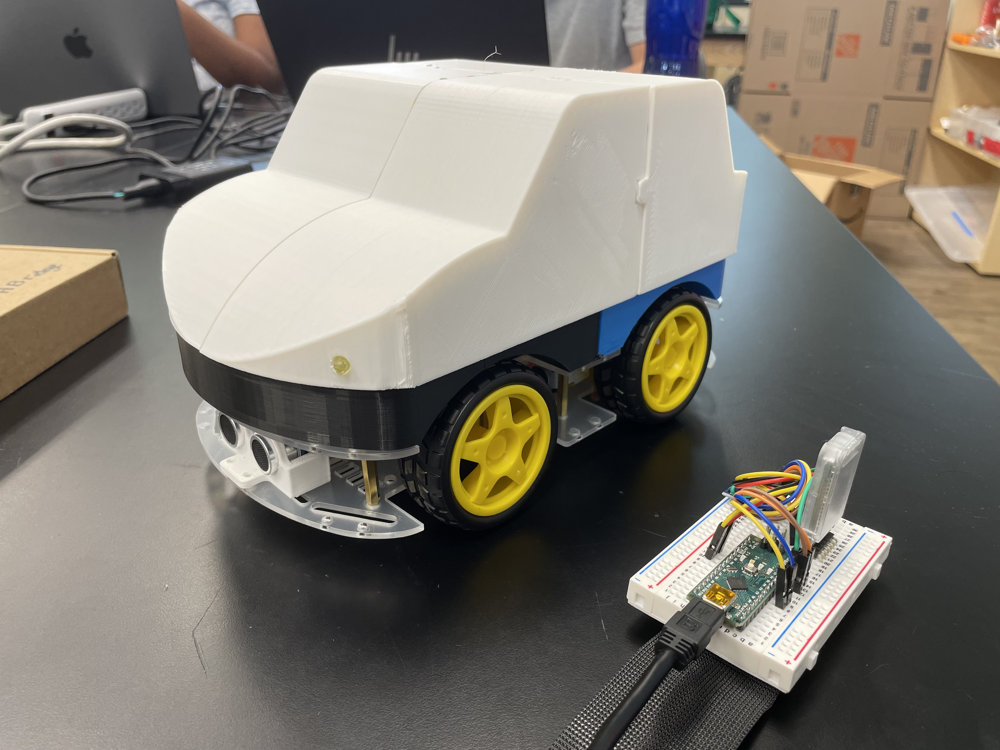
Figure 1: Image of my completed project
  
# Modification Milestone

<iframe width="560" height="315" src="https://www.youtube.com/embed/ZioR411seCw?si=Sqv1up9uiOw_xGNH" title="YouTube video player" frameborder="0" allow="accelerometer; autoplay; clipboard-write; encrypted-media; gyroscope; picture-in-picture; web-share" referrerpolicy="strict-origin-when-cross-origin" allowfullscreen></iframe>

### Description:

After completing the base project for the Gesture-Controlled Robot, I started adding modifications to it. I began by mounting two ultrasonic sensors on the front and rear of the car. To do this, I designed a case for them in Fusion 360 (Figure 2). I was able to code the sensors to detect objects at a certain distance away, and automatically stop the car if it was going to crash into them. Next, I designed a cover for the vehicle to both hide away all the wires and electronics and make the car look more realistic (Figure 3). This cover can be easily removed for easy access to the inside. To slot it onto the base, I was originally going to use a tab that could fit into an indent on the car casing. However, I went with a screw slit in the final design. This allows the screws to be adjusted along the slit, ensuring a good fit onto the base. Finally, I added four LEDs to the car, two as headlights and two as brake lights, incorporating holes in the car cover to allow them to be visible. The hardware schematics, including the modifications, are shown in Figure 17.

### Challenges:

I had many issues trying to get the ultrasonic sensor to work properly. Initially, my code had numerous bugs, and when one of the sensors was covered, the car wasn't able to move in any other direction. Even after I fixed the code, I had trouble getting the car to stop in time. There were also issues with 3D-printed parts that delayed the completion of this milestone. For some reason, one of the pieces of the car cover got printed mirrored, so I had to wait an extra day while it was reprinted. I designed the ultrasonic sensor case with a sliding back wall to get the sensor in easily, but as I wasn't sure it would work, I printed a couple of tests. The offsets on the first test weren't big enough, and after I adjusted it in Fusion, the second one worked perfectly. The screw holes on the sensor case were also too small, resulting in it taking a while to attach.

### Next steps:

Demo Night is coming up soon, so I will start preparing and practicing for my presentation, where I will demonstrate my project and how it works.

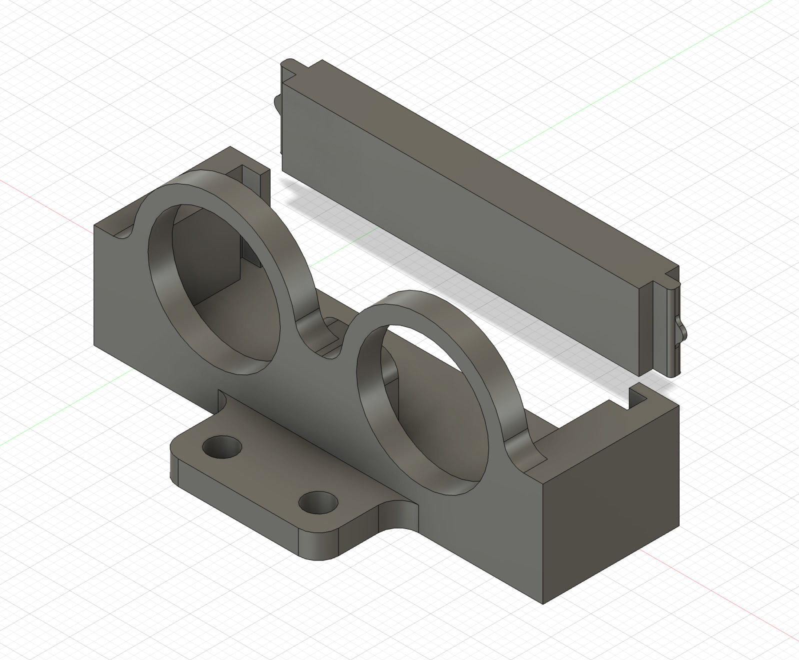
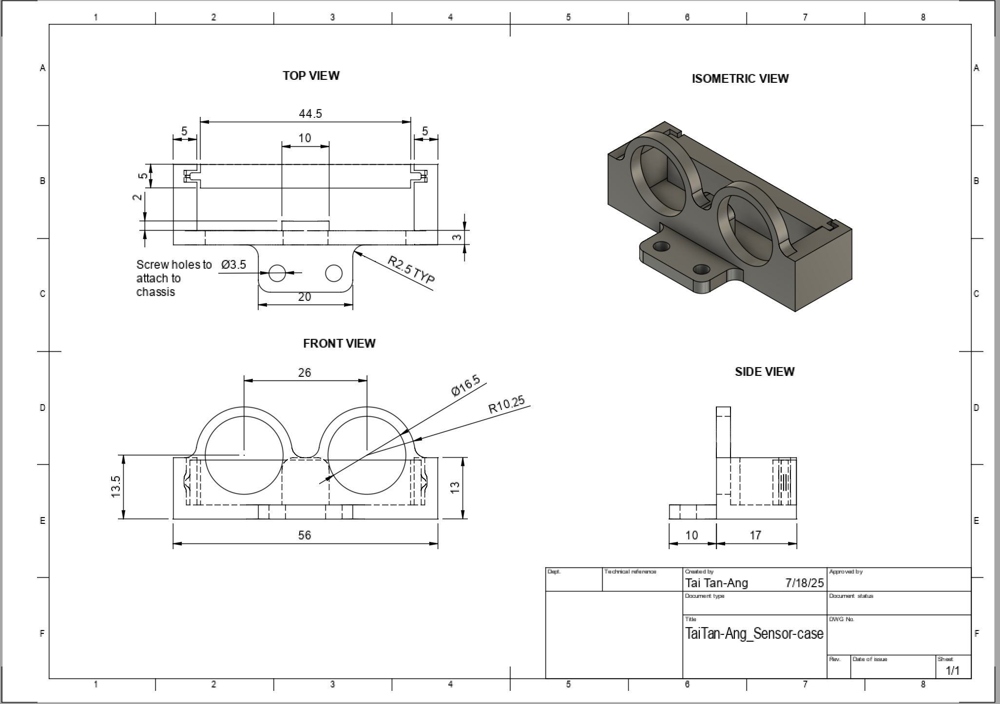
Figure 2: This is the ultrasonic sensor case in CAD and the design drawing. I designed a removable back to be able to slide the sensor in and out easily. 

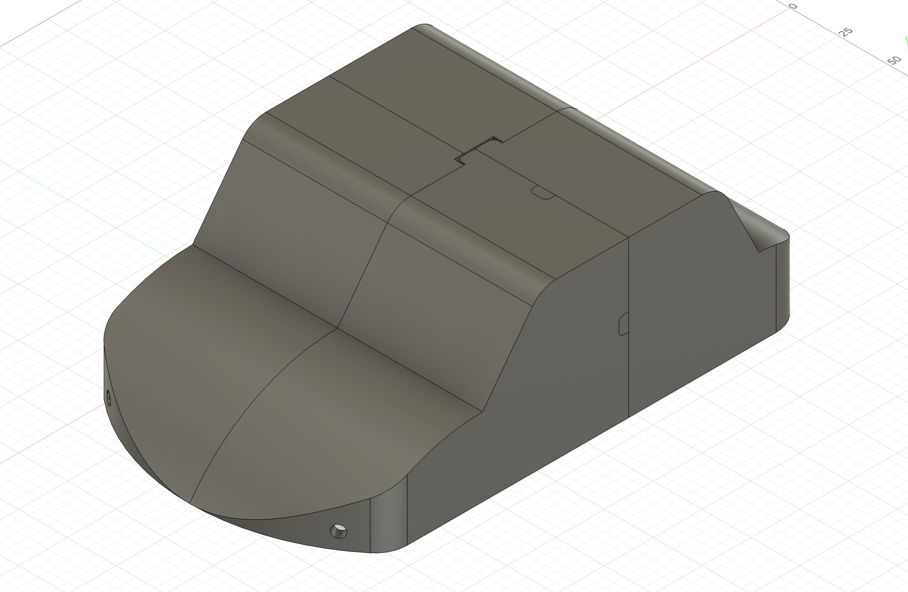
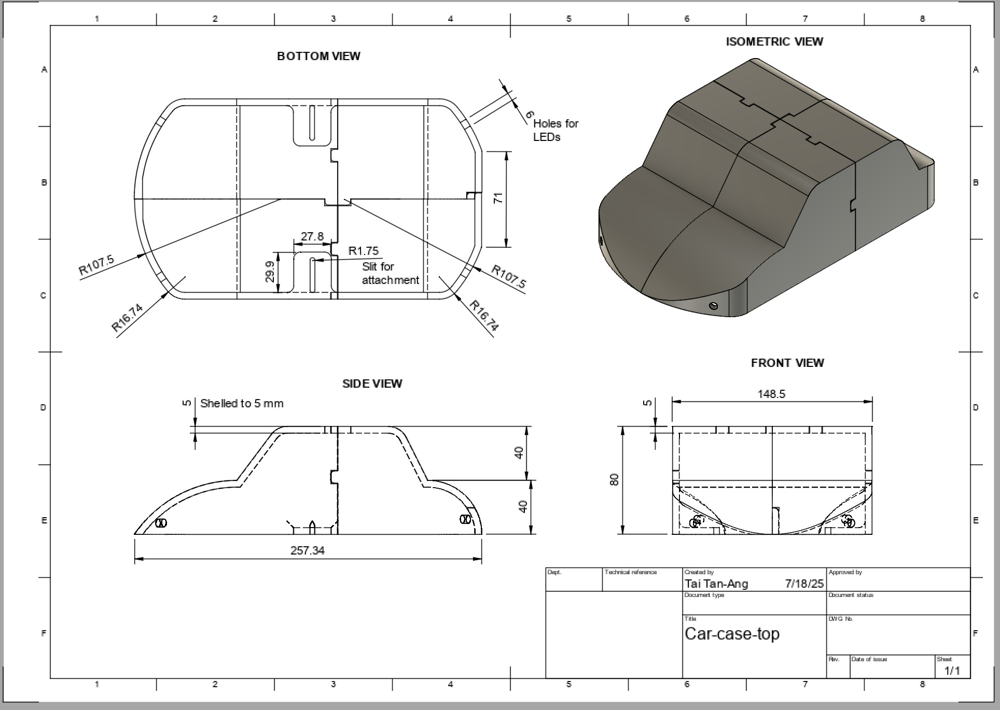
Figure 3: The CAD model of my car casing with the design drawing. I had to split it up into four parts because it was too big for the 3D printer. 

### How an Ultrasonic Sensor Works

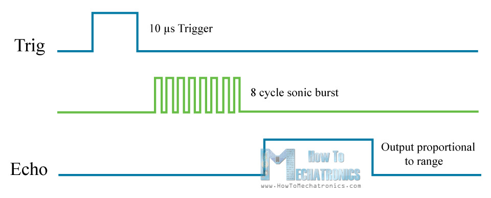
Figure 4: Diagram of how an ultrasonic sensor works

An ultrasonic sensor has two specialized pins, in addition to the power and ground pins, which work together to measure distance. The trigger pin creates an ultrasonic burst when coded high for 10 microseconds. As soon as the burst gets sent, the echo pin is set to high until it receives the burst back (the burst would have hit an object and bounced back). By recording the amount of time the echo pin is high in a variable and multiplying that by 0.034/2 (0.034 is the speed of sound in centimeters per microsecond, and it is divided by two because the burst has to travel there and back), the distance to an object can be recorded.

# Final Milestone

<iframe width="560" height="315" src="https://www.youtube.com/embed/aKtyTNzGmXI?si=Gydvsm9XCV_Sq1bm" title="YouTube video player" frameborder="0" allow="accelerometer; autoplay; clipboard-write; encrypted-media; gyroscope; picture-in-picture; web-share" referrerpolicy="strict-origin-when-cross-origin" allowfullscreen></iframe>

### Description:

For my third milestone, I designed a few custom parts for my robot using a CAD program. These include boxes to attach the Arduino Uno and the motor driver to the chassis, as well as parts for a case around the robot. I went through a few iterations of the Uno box to get it to work well. At first, I had tall walls, but I realized they weren't necessary, and it would take longer to print. I also changed the orientation by 90 degrees, as the ports would get blocked by the case, and made the screw holes larger. Refer to figures 5-7 for images. The boxes are to keep the circuit boards from sliding around on the car and include holes to screw into the chassis.  The case helps contain all the parts and provides a clean border. I had to print the case in three parts to fit onto the 3D printer, so to connect them, I used a soldering iron to melt the plastic from one part onto another (Figures 8-10).

### Challenges:

One challenge I faced during this milestone was that two of the motors weren't working properly. They wouldn't turn forward, but they were able to turn backward. I tested multiple possible ways this could have happened, including the code, wiring, solder connections, and even replacing the motor driver. However, the solution was just to rotate the motor driver 180 degrees and plug the motor wires into the opposite ports. Another challenge was getting all the dimensions for the 3D-printed parts to be correct. For example, the chassis has a few screws protruding, so I made some indents in the casing to solve this issue. However, my measurements weren't accurate, and I had to use a Dremel to remove plastic that was colliding with the screws. 

### Next steps:

This milestone means that I have finished the base project, and I will now start implementing some modifications. I will implement two sensors that will be able to detect objects. With some additional code, the robot will be able to stop if something is in its path automatically. 


Figure 5: First draft of the Arduino Uno CAD Model


Figure 6: Final CAD model of the Arduino Uno case and design drawing

Iterations:
 - lowered wall for easier access
 - widened holes from 2.5mm to 2.7mm to fit the M3 screws better
 - increased fillet size for stronger connections


Figure 7: CAD model of the L298N Motor Driver and design drawing

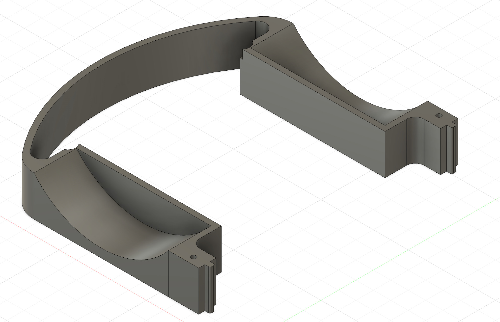
Figure 8: CAD model of the front casing 

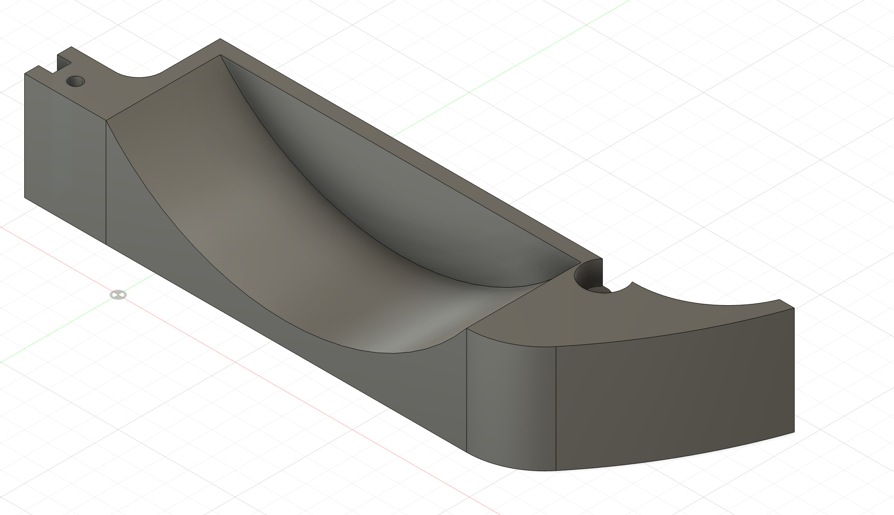
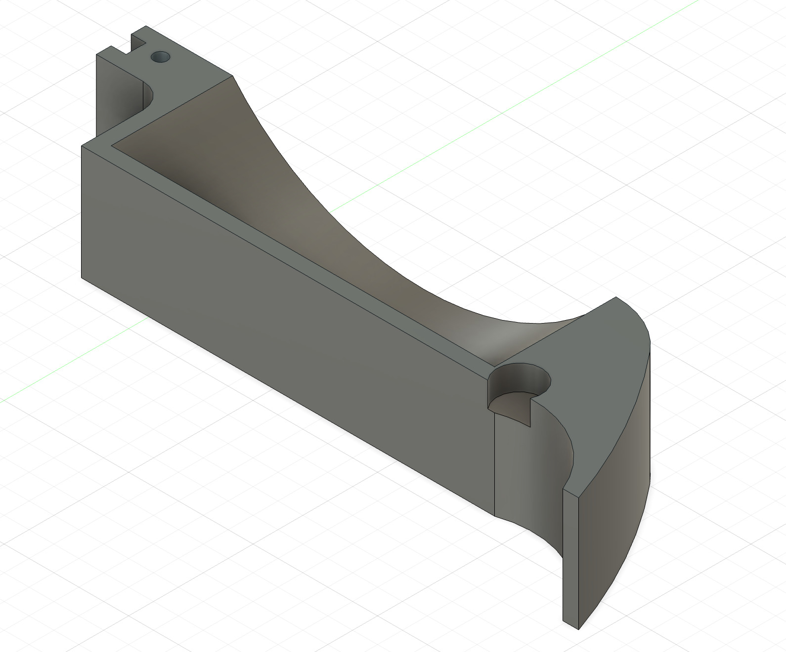
Figure 9: CAD models of the back casing, split into two parts for battery pack space

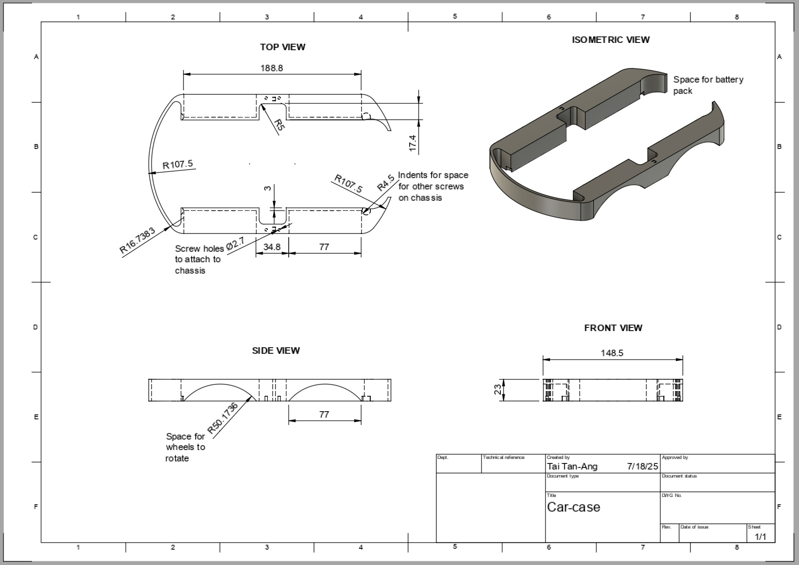
Figure 10: Design drawing for the front and back casing 

# Second Milestone

<iframe width="560" height="315" src="https://www.youtube.com/embed/3t_FfjB1K0o?si=XeNe177qP2UhYiog" title="YouTube video player" frameborder="0" allow="accelerometer; autoplay; clipboard-write; encrypted-media; gyroscope; picture-in-picture; web-share" referrerpolicy="strict-origin-when-cross-origin" allowfullscreen></iframe>

### Description:

Since the first milestone, I have been able to translate the movement of the glove into the wheels turning. To do this, I got the accelerometer to record its roll (x-axis), pitch (y-axis), and yaw (z-axis) and convert it into directions for the motors to follow (f for forward, b for backward). I then used the Bluetooth modules to send the directions over to the car (code documented in the Appendix, Milestone 2 Code, Glove). Finally, I wrote more code to take those directions and move the motors accordingly (Appendix, Milestone 2, Car code). Refer to Figure 11 for a simplified code diagram.

### Challenges:

A challenge I had was getting the Bluetooth modules to send and receive data. Initially, when I was trying to send the letters from the glove to the car, it would receive the data as ? symbols. I discovered that this was because the baud rates weren't matched, which meant that one Bluetooth module was sending data faster than the other could receive it, resulting in the data getting jumbled. After fixing the problem with the code, it was able to work. 

### Next Steps:

I will start working on cleaning up all the wires, making the glove wearable, and adding finishing touches to the robot. 


Figure 11: Flowchart of the robot's movement code

### How an HC-05 Bluetooth Module works

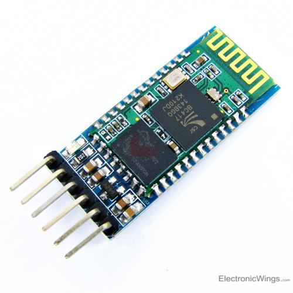
Figure 12: The HC-05 Bluetooth Module

An HC-05 module uses wireless serial communication to send and receive data to other Bluetooth devices, such as phones, computers, or other HC-05 modules. The HC-05 has two specialized pins that allow it to communicate. The TX pin on the module transmits data, while the RX pin receives data. In my project, I used two modules, one connected to the Arduino Nano on the glove and one connected to the Uno on the car, to allow the two microcontrollers to communicate. By using AT commands, the modules can be set in either 'master' or 'slave' mode, and can be configured to attempt to connect only to the other one. 

# First Milestone

<iframe width="560" height="315" src="https://www.youtube.com/embed/YEfgV6-EvwA?si=-ewlYNdKjjLRfh9_" title="YouTube video player" frameborder="0" allow="accelerometer; autoplay; clipboard-write; encrypted-media; gyroscope; picture-in-picture; web-share" referrerpolicy="strict-origin-when-cross-origin" allowfullscreen></iframe>

### Description:

My project is the Gesture Controlled Robot. For the first milestone, I completed the hardware for both the car and the glove. I soldered wires to the four motors, allowing them to connect to the L298N motor driver. Refer to the appendix section for how the motor driver works. This component is wired to the Arduino Uno, which is the 'brain' of the robot. By uploading code to it, the Arduino can tell the motor driver whether to spin forward or backward and at what speed (refer to Milestone 1 code in the appendix section). A battery case is also connected, with an on/off switch, for power. Finally, I added a Bluetooth Module to be able to communicate with the glove. Figure 15 in the schematics section shows the setup. The glove hardware is much simpler, only including an Arduino Nano, the second Bluetooth Module, and an accelerometer. The accelerometer will be used to measure the tilt of the glove. The glove hardware can be seen in Figure 16. 

### Challenges:

A challenge I had was pairing the two Bluetooth Modules together, because they weren't going into 'AT Mode'. But after some code and hardware changes, they were able to pair. I also figured out that after setting up the modules, the EN connection should be removed to let the module start pairing. 

### Next steps:

After this milestone, I will work on the software portion of the project, utilizing the Bluetooth connection to be able to steer the robot. 

### How an H-Bridge Works


Figure 13: An H-bridge circuit

An L298N motor driver has two of these H-bridge circuits to allow the DC motors to turn forward and backward. This works because by switching the polarity on a DC motor, it changes the direction the motor spins. An H-bridge works by using four switches to control the current direction. For example, if switches 1 and 4 are closed, the current will run through from left to right. And if switches 2 and 3 are closed, the current runs in the opposite direction. Although a motor driver only has two H-bridges, I used one motor driver to control all four wheels by connecting the two motors on each side to one H-bridge. This works because I don't need motors on the same side to run in opposite directions.

### How an MPU-6050 Accelerometer Works

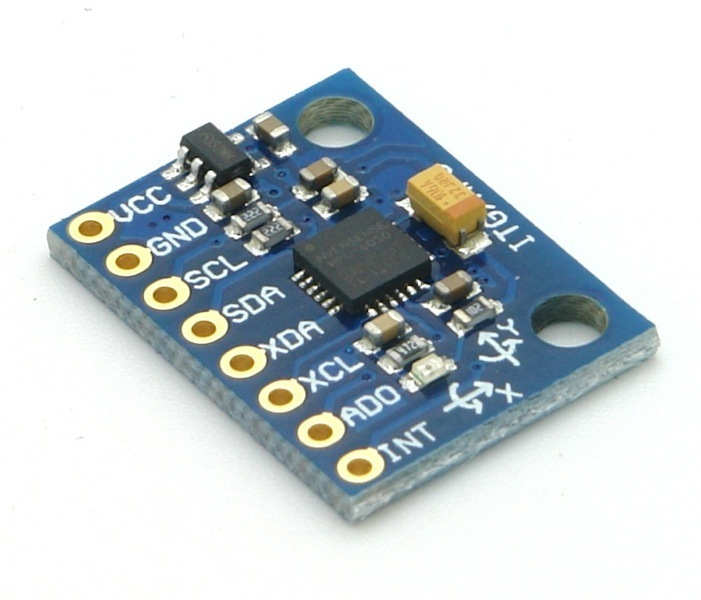
Figure 14: The MPU-6050

An MPU-6050 has a MEMS accelerometer and a MEMS gyroscope, which allow the module to measure acceleration, velocity, tilt, and orientation. The accelerometer uses inertia to detect acceleration without a starting reference point. When the accelerometer accelerates, a central mass attached to a spring system will lag due to inertia, and the springs either stretch or compress, which can be recorded as acceleration. The MEMS gyroscope has a proof mass of four parts that is connected with springs to a central structure. When tilted, different parts will move due to the Coriolis effect, and are calculated as tilt. 

# Schematics 

Figure 15: Schematic of the Gesture Controlled Robot car.


Figure 16: This is a schematic of the glove circuits. 

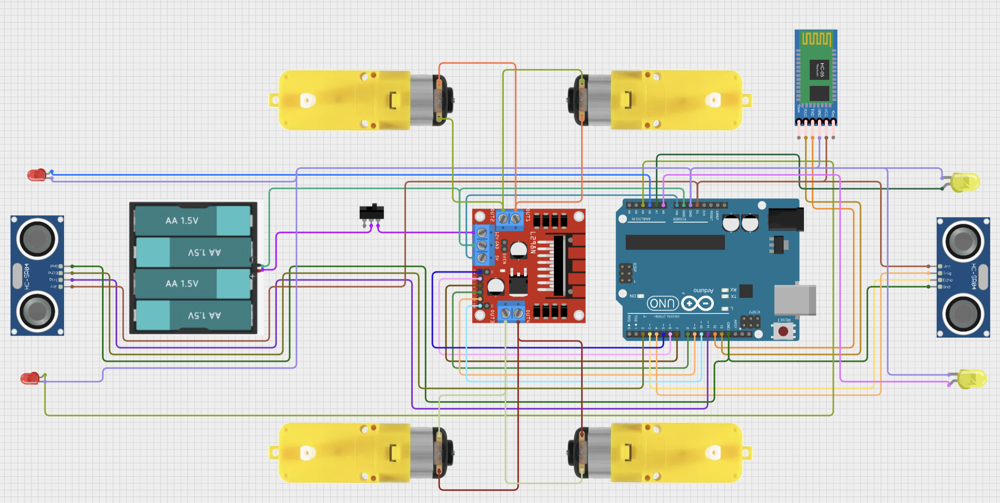
Figure 17: This is a schematic of the main car with the additional two sensors and four LED modifications

# Bill of Materials

| **Part** | **Note** | **Price** | **Link** |
|:--:|:--:|:--:|:--:|
| Robot Motor and Chassis Kit | The base of the car, including the motors and wheels | $26.54 | <a href="https://www.amazon.com/Robot-Chassis-Encoder-Education-Electronic/dp/B08LDWNWFH?gQT=1"> Link </a> |
| Arduino Uno | The 'brains' of the car, controls motor driver via HC-05 data | $27.60 | <a href="https://www.amazon.com/Arduino-A000066-ARDUINO-UNO-R3/dp/B008GRTSV6/?th=1"> Link </a> |
| L298N motor driver | Controlls wheels | $2.50 | <a href="https://www.amazon.com/Controller-H-Bridge-Stepper-Control-Mega2560/dp/B07WS89781?source=ps-sl-shoppingads-lpcontext&ref_=fplfs&gQT=2&th=1"> Link </a> |
| HC-05 (2x) | Allows for bluetooth connection between the car and the glove | $15.90 | <a href="https://www.amazon.com/Bluetooth-Converter-Wireless-Transceiver-Communication/dp/B08Z3J9Y8T/ref=asc_df_B08Z3J9Y8T?mcid=4a30dcb31db03200a4dacaa90c980433&hvocijid=8599875552977287945-B08Z3J9Y8T-&hvexpln=73&tag=hyprod-20&linkCode=df0&hvadid=721245378154&hvpos=&hvnetw=g&hvrand=8599875552977287945&hvpone=&hvptwo=&hvqmt=&hvdev=c&hvdvcmdl=&hvlocint=&hvlocphy=9032178&hvtargid=pla-2281435178058&psc=1"> Link </a> |
| Arduino Nano | Takes accelerometer data and sends it to the car via HC-05 | $24.99 | <a href="https://www.amazon.com/Arduino-A000005-ARDUINO-Nano/dp/B0097AU5OU"> Link </a> |
| MPU 6050 | Measures tilt of the glove | $6.99 | <a href="https://www.amazon.com/HiLetgo-MPU-6050-Accelerometer-Gyroscope-Converter/dp/B01DK83ZYQ?th=1"> Link </a> |
| Breadboard (2x) | Connects components together via jumper wires | $3.50 | <a href="https://www.amazon.com/Pcs-MCIGICM-Points-Solderless-Breadboard/dp/B07PCJP9DY/ref=sr_1_1_sspa?dib=eyJ2IjoiMSJ9.uMUuxM7TjrT4NHGBW155b6xNsnypcVAt2OV_S_HNFIDKaBIHI28NBIcqF1fUVd9zpDuc6vmtvPcs-t0XYbd7Qm1dK94g0OetOzfCYUkvPqAV8NoUui7Hzhq7yRcwBCbEC0OyqlXnqZ_kq8PFqBb6tndOlmU1oWR54n7-Qx7aBOHFL4dyERDhxEg6q1Bz2mMpQHVwvJi4BBgb0Qu08hyxOO66lOunRWficHVJM8ZM46w.dejGS9Mc9vNvxv2ho9vPoNOg0vwSlLXw8ipHMP8H2m0&dib_tag=se&keywords=half+size+breadboard&qid=1752876774&sr=8-1-spons&sp_csd=d2lkZ2V0TmFtZT1zcF9hdGY&psc=1"> Link </a> |
| Jumper wires | Connects components | $6.98 | <a href="https://www.amazon.com/Elegoo-EL-CP-004-Multicolored-Breadboard-arduino/dp/B01EV70C78/ref=asc_df_B01EV70C78/?tag=hyprod-20&linkCode=df0&hvadid=721245378154&hvpos=&hvnetw=g&hvrand=11066505077763342490&hvpone=&hvptwo=&hvqmt=&hvdev=c&hvdvcmdl=&hvlocint=&hvlocphy=9032178&hvtargid=pla-2281435178538&psc=1&mcid=6d8a7ca3c39a3ad4877ede949dc655a6&hvocijid=11066505077763342490-B01EV70C78-&hvexpln=73&tag=hyprod-20&linkCode=df0&hvadid=721245378154&hvpos=&hvnetw=g&hvrand=11066505077763342490&hvpone=&hvptwo=&hvqmt=&hvdev=c&hvdvcmdl=&hvlocint=&hvlocphy=9032178&hvtargid=pla-2281435178538&psc=1"> Link </a> |
| Battery holder | Holds batteries in place | $2.99 | <a href="https://www.amazon.com/LAMPVPATH-Battery-Holder-Leads-Wires/dp/B07T7MTRZX/ref=sr_1_3?dib=eyJ2IjoiMSJ9.xAPD8pmEPl4HcAAEkdhvHqqIFwQCpF96r4vJAmk2NUq8bcYIQPtjp0P6yLHCatRifIHlgodvKCApFL5YzDLwq_vyRmXhLt1kXd-T6zbY-L--xEujIK4WnC_OL6W-NGPu0AVxCzAWLTt0pH-MwKXzQ3PIpzajoXdeuIEC0tTcx3HppvKcvwvB9nZ06fyZrqjxh-hEYAnM8DGRC9qOaG7nOlDxLLJ9uxMo3_hXWC6DVMQ.9WR8pW3MQYYZxH5bebCQjkmxrqbGXLQ6DRSwNUx0bCM&dib_tag=se&hvadid=693983947338&hvdev=c&hvexpln=67&hvlocphy=9032178&hvnetw=g&hvocijid=14286192019387948153--&hvqmt=e&hvrand=14286192019387948153&hvtargid=kwd-1460573550&hydadcr=24656_13611721&keywords=4+aa+battery+holder&mcid=6dd8315b336f351ab6201841e86c09fa&qid=1752878798&sr=8-3"> Link </a> |
| HC-SR04 (2x) | Detects objects using ultrasonic waves | $13.44 | <a href="https://www.amazon.com/HC-SR04-Ultrasonic-Distance-Measuring-MEGA2560/dp/B088BT8CDW/ref=asc_df_B088BT8CDW?mcid=c77a49eccd5d3c6db2a500161e606359&hvocijid=28806463331990670-B088BT8CDW-&hvexpln=73&tag=hyprod-20&linkCode=df0&hvadid=721245378154&hvpos=&hvnetw=g&hvrand=28806463331990670&hvpone=&hvptwo=&hvqmt=&hvdev=c&hvdvcmdl=&hvlocint=&hvlocphy=9032178&hvtargid=pla-2281435177658&psc=1"> Link </a> |


# Other Resources/Examples
- [Overall tutorial](https://marobotic.com/2023/12/08/arduino-based-hand-gesture-control-robot/)
- [Arduino to Motor Driver](https://www.youtube.com/watch?v=Ey4xoG970Go)
- [Bluetooth setup](https://www.youtube.com/watch?v=I2qFXSe0W3w)
- [Ultrasonic sensor tutorial](https://howtomechatronics.com/tutorials/arduino/ultrasonic-sensor-hc-sr04/)

# Starter Milestone
<iframe width="560" height="315" src="https://www.youtube.com/embed/UMIgmopNEKk?si=oT5W1rL70Gnku_Bd" title="YouTube video player" frameborder="0" allow="accelerometer; autoplay; clipboard-write; encrypted-media; gyroscope; picture-in-picture; web-share" referrerpolicy="strict-origin-when-cross-origin" allowfullscreen></iframe>

### Description:

My starter project was the Weevil Eye. I chose this project because it made me work on my soldering skills, and I got something cool to take home as well. The function of the Weevil Eye is that when it senses that it is dark, two LED 'eyes' turn on, and when there is light, it turns off.

### Challenges:

I faced numerous challenges while soldering to complete this project. It was my first day soldering, so my technique wasn't the best, resulting in the Weevil Eye not functioning properly. After a bit more practice soldering, I restarted with a new Weevil Eye, and that time it worked as intended. 

### Next steps:

The primary purpose of this project was for me to learn soldering, and it was successful. If I need to solder for my intensive project, I will know how to do it. 

# Appendix

## <b> Modification Code </b>

### Glove code:
 <details markdown='1'>
  <summary> <b> Click to view ↓ </b>  </summary>
  
  ```c++
#include <Wire.h>                             //including a library to get data from accelerometer
#include <SoftwareSerial.h>                   //including a library for bluetooth communciation
SoftwareSerial Bluetooth(2,3);                //sets the bluetooth pins to 2 and 3 on the nano

const int MPU = 0x68;                         // MPU6050 I2C address
float AccX, AccY, AccZ;                       //variables for accelerometer data
char data = 'n';                              //sets car data as 'n', so doesn't start sending data until it is connected
    
void read(){                                  //read data from accelerometer function
  Wire.beginTransmission(MPU);                //starts transmission to the accelerometer
  Wire.write(0x3B);                           //tells where to start reading from
  Wire.endTransmission(false);                //doesn't stop
  Wire.requestFrom(MPU, 6, true);             // request a total of 6 bytes
  
  AccX = (Wire.read() << 8 | Wire.read());    //combines two bytes from each axis 
  AccY = (Wire.read() << 8 | Wire.read());    //to get x, y, and z data
  AccZ = (Wire.read() << 8 | Wire.read());

  AccX = map(AccX, -17000, 17000, 0, 180);    //maps the data (originally from around 
  AccY = map(AccY, -17000, 17000, 0, 180);    // -17000 to 17000) to 0 to 180.
  AccZ = map(AccZ, -17000, 17000, 0, 180);


  Serial.print("X: ");                        //prints data for easy monitoring
  Serial.print(AccX);
  Serial.print("  Y: ");
  Serial.print(AccY);
  Serial.print("  Z: ");
  Serial.println(AccZ);
  delay(100);
}

void setup() {                                //setup code
  Wire.begin();                               //starts the accelerometer
  Wire.beginTransmission(MPU);                //starts a transmission to the
  Wire.write(0x6B);                           //0x6b register (which is responsible for power)
  Wire.write(0);                              // set to zero (wakes it up)
  Wire.endTransmission(true);                 //ends the transmission
  Serial.begin(9600);                         //starts serial
  Bluetooth.begin(9600);                      //starts bluetooth
}

void loop() {
  if(Bluetooth.available() > 0){              //checks if there is data to be read from the car
    data = Bluetooth.read();                  //reads data and stores it in 'data' var.
    Serial.println(data);
  }
  if (data != 'n'){                           //only runs if data isn't n (which means car is in special movement)
    read();                                   //calls read function to read accelerometer data
    if(data != 'f'){                          //only sends forward data if nothing is blocking forward sensor on car
      if(0 < AccX && AccX <= 20){             //If X is between 0 and 20, which is high tilt forward,
        Bluetooth.write("F");                 //sends 'F' to the car
        delay(100);
      }
      if(20 < AccX && AccX <= 40){            //If X is between 20 and 40, which is medium tilt forward,
        Bluetooth.write("f");                 //sends 'f' to the car
        delay(100);
      }
      if(40 < AccX && AccX <= 60){            //If X is between 40 and 60, which is low tilt forward,
        Bluetooth.write("d");                 //sends 'd' to the car
        delay(100);
      }
    }
    if(data != 'b'){                          //only sends backward data if nothing is blocking backward sensor on car
      if (180 > AccX && AccX >= 160){         //If X is between 180 and 160, which is high tilt backward,
        Bluetooth.write("B");                 //sends 'B' to the car
        delay(100);
      }
      if (160 > AccX && AccX >= 140){         //If X is between 160 and 140, which is medium tilt backward,
        Bluetooth.write("b");                 //sends 'b' to the car
        delay(100);
      }
      if (140 > AccX && AccX >= 120){         //If X is between 140 and 120, which is low tilt backward,
        Bluetooth.write("v");                 //sends 'v' to the car
        delay(100);
      }
    }
    if (0 < AccY && AccY <= 20){              //If Y is between 0 and 20, which is high tilt left,
      Bluetooth.write("L");                   //sends 'L' to the car
      delay(100);
    } 
    if (20 < AccY && AccY <= 40){             //If Y is between 20 and 40, which is medium tilt left,
      Bluetooth.write("l");                   //sends 'l' to the car
      delay(100);
    } 
    if (40 < AccY && AccY <= 60){             //If Y is between 40 and 60, which is low tilt left,
      Bluetooth.write("k");                   //sends 'k' to the car
      delay(100);
    } 
    if (180 > AccY && AccY >= 160){           //If Y is between 180 and 160, which is high tilt right,
      Bluetooth.write("R");                   //sends 'R' to the car
      delay(100);
    } 
    if (160 > AccY && AccY >= 140){           //If Y is between 160 and 140, which is medium tilt right,
      Bluetooth.write("r");                   //sends 'r' to the car
      delay(100);
    } 
    if (140 > AccY && AccY >= 120){           //If Y is between 140 and 120, which is low tilt right,
      Bluetooth.write("e");                   //sends 'e' to the car
      delay(100);
    } 
    if (60 < AccX && AccX < 120 && 60 < AccY && AccY < 120){//If both x and y are in neutral position,
      Bluetooth.write("S");                                 //Sends 'S' to the car
      delay(100);
    }
  }
}

// Speeds:    Low   | Medium |  High  
// Forward:    d    |    f   |    F
// Backward:   v    |    b   |    B
// Right:      e    |    r   |    R
// Left:       k    |    l   |    L

```
</details>


### Driving code:
<details markdown='1'>
  <summary> <b> Click to view ↓ </b></summary>
  
  ```c++
#include <SoftwareSerial.h>             //gets the bluetooth library
SoftwareSerial Bluetooth(12,13);        //sets the bluetooth module's pins to 12 and 13 on the uno
char data;                              //variable to store accelerometer's data
int activate = 0;                       //variable to activate special movement checks
int yes = 0;                            //variable to trigger special movement
int speed = 255;                        //starting speed, can change
unsigned long previousMillis = 0;       //variable to record amount of time since movement 1 of 2 has finished for special movement
const long interval = 300;              //amount of time allowed since 1st movement finished to activate special movement
unsigned long currentMillis;            //records current time 

int enA = 5;                            //sets pins from the motor driver to 5-10 on the uno
int in1 = 6;
int in2 = 7;
int in3 = 8;
int in4 = 9;
int enB = 10;

int trigPin = 4;                        //sets the trigger pin for forward sensor
int echoPin = 3;                        //sets the echo pin for forward sensor
long duration;                          //records duration of echo for forward sensor
float distance;                         //stores the distance of objects for forward sensor
int forwardblock = 0;                   //gets activated if objects are closer than the set distance (block var) for forward sensor

int trigPin1 = 11;                      //sets the trigger pin for backward sensor
int echoPin1 = 2;                       //sets the echo pin for backward sensor
long duration1;                         //records duration of echo for backward sensor
float distance1;                        //stores the distance of objects for backward sensor
int backblock = 0;                      //gets activated if objects are closer than the set distance (block var) for backward sensor

int block = 10;                         //distance threshold that blocks movement

void forward() {                        //function to drive forward
  if (forwardblock == 0) {              //only works if forward block isn't activated (objects are further than 'block' distance)
    digitalWrite(in1, HIGH);
    digitalWrite(in2, LOW);
    analogWrite(enA, speed);
    digitalWrite(in3, LOW);
    digitalWrite(in4, HIGH);
    analogWrite(enB, speed);
    delay(100);
  }
}

void checkforward() {                   //function to check if acceleromter data wants robot to move forward
  if(data == 'F'){                      //'F' makes it go forward full speed
    forward();                          //Calls forward function
    speed = 255;                        //Sets speed to high
  }
  if(data == 'f'){                      //'f' makes it go forward medium speed
    forward();                          //Calls forward function
    speed = 200;                        //Sets speed to medium
  }
  if(data == 'd'){                      //'d' makes it go forward low speed
    forward();                          //Calls forward function
    speed = 150;                        //Sets speed to low
  }
}

void backward() {                       //function to drive backward
  if (backblock == 0) {                 //only works if backward block isn't activated (objects are further than 'block' distance)
    digitalWrite(in1, LOW);
    digitalWrite(in2, HIGH);
    analogWrite(enA, speed);
    digitalWrite(in3, HIGH);
    digitalWrite(in4, LOW);
    analogWrite(enB, speed);
    delay(100);
  }
}

void checkbackward() {                  //function to check if acceleromter data wants robot to move backward
  if(data == 'B'){                      //'B' makes it go backward full speed
    backward();                         //Calls backward function
    speed = 255;                        //Sets speed to high
  }
  if(data == 'b'){                      //'b' makes it go backward medium speed
    backward();                         //Calls backward function
    speed = 200;                        //Sets speed to medium
  }
  if(data == 'v'){                      //'v' makes it go backward low speed
    backward();                         //Calls backward function
    speed = 150;                        //Sets speed to low
  }
}

void left(){                            //function to drive left
  digitalWrite(in1, HIGH);
  digitalWrite(in2, LOW);
  analogWrite(enA, speed);
  digitalWrite(in3, HIGH);
  digitalWrite(in4, LOW);
  analogWrite(enB, speed);
  delay(100);
}

void checkleft() {                      //function to check if acceleromter data wants robot to move left
  if(data == 'L'){                      //'L' makes it go left full speed
    left();                             //Calls right function
    speed = 255;                        //Sets speed to high
  }
  if(data == 'l'){                      //'l' makes it go left medium speed
    left();                             //Calls right function
    speed = 255;                        //Sets speed to medium
  }
  if(data == 'k'){                      //'k' makes it go left low speed
    left();                             //Calls right function
    speed = 150;                        //Sets speed to low
  }
}

void right(){                           //function to drive right
  digitalWrite(in1, LOW);
  digitalWrite(in2, HIGH);
  analogWrite(enA, speed);
  analogWrite(enB, speed);
  digitalWrite(in3, LOW);
  digitalWrite(in4, HIGH);
  delay(100);
}

void checkright() {                     //function to check if acceleromter data wants robot to move right
  if(data == 'R'){                      //'R' makes it go right full speed
    right();                            //Calls right function
    speed = 255;                        //Sets speed to high
  }
  if(data == 'r'){                      //'r' makes it go right medium speed
    right();                            //Calls right function
    speed = 200;                        //Sets speed to medium
  }
  if(data == 'e'){                      //'e' makes it go right low speed
    right();                            //Calls right function
    speed = 150;                        //Sets speed to low
  }
}

void stop(){                            //function to stop the robot
  digitalWrite(in1, LOW);
  digitalWrite(in2, LOW);
  digitalWrite(in3, LOW);
  digitalWrite(in4, LOW);
  delay(100);
}

void checkstop(){                       //function to check if acceleromter data wants robot to move stop
  if (data == 'S'){                     //'S' makes it go left full speed
    stop();                             //Calls stop function     
  }
}

void sense() {                          //function to check forward sensor
  digitalWrite(trigPin, LOW);           //makes sure sensor is off before sending 
  delayMicroseconds(2);
  digitalWrite(trigPin, HIGH);          //sets the trig pin to high for 10 microseconds, which triggers an ultrasonic burst
  delayMicroseconds(10);
  digitalWrite(trigPin, LOW);           

  duration = pulseIn(echoPin, HIGH);    //records the amount of time the echo pin is high (which is until it receives the ultrasonic wave back)

  distance = duration * 0.034 / 2;      //calculates distance using the speed of sound, divides by two because wave has to go there and back

  if (distance < block) {               //if the distance is closer than the block distance, 
    forwardblock = 1;                   //'forwardblock' gets triggered, which blocks movement forward
  } else {
    forwardblock = 0;                   //otherwise it is off
  }
}

void sense1() {                         //same as sense() function but with the backward sensor
  digitalWrite(trigPin1, LOW);
  delayMicroseconds(2);
  digitalWrite(trigPin1, HIGH);
  delayMicroseconds(10);
  digitalWrite(trigPin1, LOW);

  duration1 = pulseIn(echoPin1, HIGH);

  distance1 = duration1 * 0.034 / 2;

  if (distance1 < block) {
    backblock = 1;
  } else {
    backblock = 0;
  }
}

void setup() {                          //setup code, runs once
  Serial.begin(9600);                   //starts serial monitor
  Bluetooth.begin(9600);                //starts bluetooth
  pinMode(enA, OUTPUT);                 //sets motor driver pins to outputs
  pinMode(in1, OUTPUT);
  pinMode(in2, OUTPUT);
  pinMode(in3, OUTPUT);
  pinMode(in4, OUTPUT);
  pinMode(enB, OUTPUT);
  pinMode(trigPin, OUTPUT);             //sets trigger pins as outputs and echo pins as inputs for the two sensors
  pinMode(echoPin, INPUT);
  pinMode(trigPin1, OUTPUT);
  pinMode(echoPin1, INPUT);
  Bluetooth.write("y");                 //tells glove that it is ready
}

void loop() {                           //loop runs forever
  currentMillis = millis();             //updates time
  if(Bluetooth.available() > 0){        //runs if the bluetooth is connected
    switch (yes) {                      
      case 0:                           //runs if special movement isn't triggered
        data = Bluetooth.read();        //reads instructions from glove
        delay(100);
        Serial.println(data);           //prints data for easy monitoring
        sense();                        //calls both sensor functions to check distances
        sense1();
        Serial.println(forwardblock);   
        Serial.println(backblock);
        while (forwardblock == 1) {     //if object is in front of robot
          Bluetooth.write("f");         //tells glove to not send forward data
          sense();                      //keeps checking if object has disappeared
          data = Bluetooth.read();      //reads data because cannot exit loop until object is gone
          Serial.println(data);         
          if (forwardblock == 1 && (data == 'F' || data == 'f' || data == 'd')) { //stops car if it is already moving
            stop();
          }
          if (backblock != 1) {         //checks backward data if back isn't blocked
            checkbackward();
          }
          checkleft();                  //also checks left, right, and stop
          checkright();
          checkstop();
          delay(100);
        }
        while (backblock == 1) {        //same as while loop above but with backward sensor
          Bluetooth.write("b");
          sense1();
          data = Bluetooth.read();
          Serial.println(data);
          if (backblock == 1 && (data == 'B' || data == 'b' || data == 'v')) {
            stop();
          }
          if(forwardblock != 1){
            checkforward();
          }
          checkleft();
          checkright();
          checkstop();
          delay(100);
        }
        Bluetooth.write("y");           //writes 'y' to the glove when everything is clear

        if ((data == 'R' || data == 'r' || data == 'e')) { //first action for special movement
          previousMillis = currentMillis;                  //sets timer
          activate = 1;                                    //activates next if statement
        }
        if ((activate == 1) && (currentMillis - previousMillis <= interval) && (data == 'L' || data == 'l' || data == 'k')) {
          activate = 0; //this if statement is triggered if a right movement was detected and within the 0.3 seconds a left movement was detected
          yes = 1;      //activates second case in the switch
        }
        if (forwardblock != 1) {            //checks for forward movement if nothing is obstructing the forward sensor
          checkforward();
        }
        if (backblock != 1) {               //checks for backward movement if nothing is obstructing the backward sensor
          checkbackward();
        }
        checkright();                       //checks for left, right, and stop data
        checkleft();
        checkstop();
        break;
      case 1:                               //runs if special movement is triggered
        stop();                             //stops robot if it was moving
        Bluetooth.write("n");               //tells glove to stop sending data
        for (int i = 1; i < 51; i++) {      //can code anything run for any amount of time
          speed = 150;
          stop();
        }
        yes = 0;                            //resets special movement var.
        break;
    }
  }
}

// Speeds:    Low   | Medium |  High
// Forward:    d    |    f   |    F
// Backward:   v    |    b   |    B
// Right:      e    |    r   |    R
// Left:       k    |    l   |    L

```
</details>

## <b> Milestone 2 Code </b>

### Glove code:
<details markdown='1'>
  <summary> <b> Click to view ↓ </b></summary>
  
  ```c++
#include <Wire.h>                          //including a library to get data from accelerometer
#include <SoftwareSerial.h>                //including a library for bluetooth communciation
SoftwareSerial Bluetooth(2,3);             //sets the bluetooth pins to 2 and 3 on the nano

const int MPU = 0x68;                      // MPU6050 I2C address
float AccX, AccY, AccZ;                    //variables for accelerometer data

void read(){
  Wire.beginTransmission(MPU);             //starts transmission to the accelerometer
  Wire.write(0x3B);                        //tells where to start reading from
  Wire.endTransmission(false);             //doesn't stop
  Wire.requestFrom(MPU, 6, true);          // request a total of 6 bytes

  AccX = (Wire.read() << 8 | Wire.read()); //combines two bytes from each axis 
  AccY = (Wire.read() << 8 | Wire.read()); //to get x, y, and z data
  AccZ = (Wire.read() << 8 | Wire.read());

  AccX = map(AccX, -17000, 17000, 0, 180); //maps the data (originally from around 
  AccY = map(AccY, -17000, 17000, 0, 180); // -17000 to 17000) to 0 to 180.
  AccZ = map(AccZ, -17000, 17000, 0, 180);


  Serial.print("X: ");                      //prints data for easy monitoring
  Serial.print(AccX);
  Serial.print("  Y: ");
  Serial.print(AccY);
  Serial.print("  Z: ");
  Serial.println(AccZ);
  delay(100);
}

void setup() {                                //setup code
  Wire.begin();                               //starts the accelerometer
  Wire.beginTransmission(MPU);                //starts a transmission to the
  Wire.write(0x6B);                           //0x6b register (which is responsible for power)
  Wire.write(0);                              // set to zero (wakes it up)
  Wire.endTransmission(true);                 //ends the transmission
  Serial.begin(9600);                         //starts serial
  Bluetooth.begin(9600);                      //starts bluetooth
}

void loop() {
  read();                                     //calls read function
  if(0 < AccX && AccX <= 20){                 //If X is between 0 and 20, which is high tilt backward,
    Bluetooth.write("B");                     //sends 'B' to the car
    delay(100);
  }
  else if(20 < AccX && AccX <= 40){           //If X is between 20 and 40, which is medium tilt backward,
    Bluetooth.write("b");                     //sends 'b' to the car
    delay(100);
  }
  else if(40 < AccX && AccX <= 60){           //If X is between 40 and 60, which is low tilt backward,
    Bluetooth.write("v");                     //sends 'v' to the car
    delay(100);
  }
  else if (180 > AccX && AccX >= 160){        //If X is between 180 and 160, which is high tilt forward,
    Bluetooth.write("F");                     //sends 'F' to the car
    delay(100);
  }
  else if (160 > AccX && AccX >= 140){        //If X is between 160 and 140, which is medium tilt forward,
    Bluetooth.write("f");                     //sends 'f' to the car
    delay(100);
  }
  else if (140 > AccX && AccX >= 120){        //If X is between 140 and 120, which is low tilt forward,
    Bluetooth.write("d");                     //sends 'd' to the car
    delay(100);
  } 
  else if (0 < AccY && AccY <= 20){           //If Y is between 0 and 20, which is high tilt right,
    Bluetooth.write("R");                     //sends 'R' to the car
    delay(100);
  } 
  else if (20 < AccY && AccY <= 40){          //If Y is between 20 and 40, which is medium tilt right,
    Bluetooth.write("r");                     //sends 'r' to the car
    delay(100);
  } 
  else if (40 < AccY && AccY <= 60){          //If Y is between 40 and 60, which is low tilt right,
    Bluetooth.write("e");                     //sends 'e' to the car
    delay(100);
  } 
  else if (180 > AccY && AccY >= 160){        //If Y is between 180 and 160, which is high tilt left,
    Bluetooth.write("L");                     //sends 'L' to the car
    delay(100);
  } 
  else if (160 > AccY && AccY >= 140){        //If Y is between 160 and 140, which is medium tilt left,
    Bluetooth.write("l");                     //sends 'l' to the car
    delay(100);
  } 
  else if (140 > AccY && AccY >= 120){        //If Y is between 140 and 120, which is low tilt left,
    Bluetooth.write("k");                     //sends 'k' to the car
    delay(100);
  } 
  else if (60 < AccX && AccX < 120 && 60 < AccY && AccY < 120){ //If both x and y are in neutral position,
    Bluetooth.write("S");                                       //Sends 'S' to the car
    delay(100);
  }
}

// Speeds:    Low   | Medium |  High  
// Forward:    d    |    f   |    F
// Backward:   v    |    b   |    B
// Right:      e    |    r   |    R
// Left:       k    |    l   |    L


```
</details>

### Driving code:
<details markdown='1'>
  <summary> <b> Click to view ↓ </b></summary>
  
  ```c++
#include <SoftwareSerial.h>             //gets the bluetooth library
SoftwareSerial Bluetooth(12,13);        // sets the bluetooth module's pins to 12 and 13 on the uno
char data;                              //variable to store accelerometer's data
int speed = 255;                        //starting speed, can change

int enA = 5;                            //sets pins from the motor driver to 5-10 on the uno
int in1 = 6;
int in2 = 7;
int in3 = 8;
int in4 = 9;
int enB = 10;

void forward(){                         //function to drive forward
  digitalWrite(in1, HIGH);
  digitalWrite(in2, LOW);
  analogWrite(enA, speed);
  digitalWrite(in3, LOW);
  digitalWrite(in4, HIGH);
  analogWrite(enB, speed);
  delay(100);
}

void backward(){                         //function to drive backward
  digitalWrite(in1, LOW);
  digitalWrite(in2, HIGH);
  analogWrite(enA, speed);
  digitalWrite(in3, HIGH);
  digitalWrite(in4, LOW);
  analogWrite(enB, speed);
  delay(100);
}

void left(){                              //function to drive left
  digitalWrite(in1, HIGH);
  digitalWrite(in2, LOW);
  analogWrite(enA, speed);
  digitalWrite(in3, HIGH);
  digitalWrite(in4, LOW);
  delay(100);
}

void right(){                             //function to drive right
  digitalWrite(in1, LOW);
  digitalWrite(in2, HIGH);
  analogWrite(enB, speed);
  digitalWrite(in3, LOW);
  digitalWrite(in4, HIGH);
  delay(100);
}

void stop(){                              //function to stop the robot
  digitalWrite(in1, LOW);
  digitalWrite(in2, LOW);
  digitalWrite(in3, LOW);
  digitalWrite(in4, LOW);
  delay(100);
}


void setup() {                            //setup code, runs once
  Serial.begin(9600);                     //starts the serial monitor
  Bluetooth.begin(9600);                  //starts the bluetooth
  pinMode(enA, OUTPUT);                   //sets all the motor driver's pins to outputs.
  pinMode(in1, OUTPUT);
  pinMode(in2, OUTPUT);
  pinMode(in3, OUTPUT);
  pinMode(in4, OUTPUT);
  pinMode(enB, OUTPUT);
}

void loop() {                             //will run forever
  if(Bluetooth.available() > 0){          //runs if the bluetooth is connected
    data = Bluetooth.read();              //reads data from the acceleromter, stores it in the data var.
    delay(100);                           //keeps it from doing things too fast
    Serial.println(data);                 //prints data for easy montitoring
    if(data == 'F'){                      //'F' makes it go forward full speed
      forward();                          //Calls forward function
      speed = 255;                        //Sets speed to high
    }
    if(data == 'f'){                      //'f' makes it go forward medium speed
      forward();                          //Calls forward function
      speed = 200;                        //Sets speed to medium
    }
    if(data == 'd'){                      //'d' makes it go forward low speed
      forward();                          //Calls forward function
      speed = 150;                        //Sets speed to low
    }
    if(data == 'B'){                      //'B' makes it go backward full speed
      backward();                         //Calls backward function
      speed = 255;                        //Sets speed to high
    }
    if(data == 'b'){                      //'b' makes it go backward medium speed
      backward();                         //Calls backward function
      speed = 200;                        //Sets speed to medium
    }
    if(data == 'v'){                      //'v' makes it go backward low speed
      backward();                         //Calls backward function
      speed = 150;                        //Sets speed to low
    }
    if(data == 'R'){                      //'R' makes it go right full speed
      right();                            //Calls right function
      speed = 255;                        //Sets speed to high
    }
    if(data == 'r'){                      //'r' makes it go right medium speed
      right();                            //Calls right function
      speed = 200;                        //Sets speed to medium
    }
    if(data == 'e'){                      //'e' makes it go right low speed
      right();                            //Calls right function
      speed = 150;                        //Sets speed to low
    }
    if(data == 'L'){                      //'L' makes it go left full speed
      left();                             //Calls right function
      speed = 255;                        //Sets speed to high
    }
    if(data == 'l'){                      //'l' makes it go left medium speed
      left();                             //Calls right function
      speed = 255;                        //Sets speed to medium
    }
    if(data == 'k'){                      //'k' makes it go left low speed
      left();                             //Calls right function
      speed = 150;                        //Sets speed to low
    }
    if (data == 'S'){                     //'S' makes it go left full speed
      stop();                             //Calls stop function     
    }
  }
}

// Speeds:    Low   | Medium |  High  
// Forward:    d    |    f   |    F
// Backward:   v    |    b   |    B
// Right:      e    |    r   |    R
// Left:       k    |    l   |    L

```
</details>

## <b> Milestone 1 Code </b>

### Driving code:
<details markdown='1'>
  <summary> <b> Click to view ↓ </b></summary>
  
  ```c++

int enA = 5;                  // Sets motor driver pins to 5-10 on the Uno
int in1 = 6;
int in2 = 7;
int in3 = 8;
int in4 = 9;
int enB = 10;

void driveforward(){          // Function to drive forward
  digitalWrite(in1, HIGH);
  digitalWrite(in2, LOW);
 analogWrite(enA, 255);
  digitalWrite(in3, LOW);
  digitalWrite(in4, HIGH);
  analogWrite(enB, 255);
  delay(1000);
}

void drivebackward(){          // Function to drive backward
  digitalWrite(in1, LOW);
  digitalWrite(in2, HIGH);
  analogWrite(enA, 255);
  digitalWrite(in3, HIGH);
  digitalWrite(in4, LOW);
  analogWrite(enB, 255);
  delay(1000);
}

void left(){                    // Function to drive left
  digitalWrite(in1, HIGH);
  digitalWrite(in2, LOW);
  analogWrite(enA, 255);
  digitalWrite(in3, LOW);
  digitalWrite(in4, LOW);
  delay(1000);
}

void right(){                   // Function to drive right
  digitalWrite(in1, LOW);
  digitalWrite(in2, LOW);
  analogWrite(enA, 255);
  digitalWrite(in3, LOW);
  digitalWrite(in4, HIGH);
  delay(1000);
}

void stop(){                    // Function to stop
  digitalWrite(in1, LOW);
  digitalWrite(in2, LOW);
  digitalWrite(in3, LOW);
  digitalWrite(in4, LOW);
  delay(1000);
}


void setup() {                   //Setup code, runs once
  Serial.begin(9600);            //Starts serial monitor
  pinMode(enA, OUTPUT);          //Sets motor driver pins to outputs
  pinMode(in1, OUTPUT);
  pinMode(in2, OUTPUT);
  pinMode(in3, OUTPUT);
  pinMode(in4, OUTPUT);
  pinMode(enB, OUTPUT);

}

void loop(){                     // Code runs in a loop forever
  driveforward();                // Makes wheels run forward,
  stop();                        // then stop,
  drivebackward();               // backward,
  stop();                        // and stop again, then repeats
}

```
</details>


### Get data from accelerometer:
<details markdown='1'>
  <summary> <b> Click to view ↓ </b></summary>
  
  ```c++
#include <Wire.h>                             //including a library to get data from accelerometer

const int MPU = 0x68;                         // MPU6050 I2C address
float AccX, AccY, AccZ;

void setup() {                                //setup code
  Wire.begin();                               //starts the accelerometer
  Wire.beginTransmission(MPU);                //starts a transmission to the
  Wire.write(0x6B);                           //0x6b register (which is responsible for power)
  Wire.write(0);                              // set to zero (wakes it up)
  Wire.endTransmission(true);                 //ends the transmission
  Serial.begin(9600);                         //starts serial
}

void loop() {
  Wire.beginTransmission(MPU);                //starts transmission to the accelerometer
  Wire.write(0x3B);                           //tells where to start reading from
  Wire.endTransmission(false);                //doesn't stop
  Wire.requestFrom(MPU, 6, true);             // request a total of 6 bytes
  
  AccX = (Wire.read() << 8 | Wire.read());    //combines two bytes from each axis 
  AccY = (Wire.read() << 8 | Wire.read());    //to get x, y, and z data
  AccZ = (Wire.read() << 8 | Wire.read());

  AccX = map(AccX, -17000, 17000, 0, 180);    //maps the data (originally from around 
  AccY = map(AccY, -17000, 17000, 0, 180);    // -17000 to 17000) to 0 to 180.
  AccZ = map(AccZ, -17000, 17000, 0, 180);


  Serial.print("X: ");                        //prints data for easy monitoring
  Serial.print(AccX);
  Serial.print("  Y: ");
  Serial.print(AccY);
  Serial.print("  Z: ");
  Serial.println(AccZ);
  delay(100);
}
```
</details>


### Set up AT Commands for Bluetooth Modules:
<details markdown='1'>
  <summary> <b> Click to view ↓ </b></summary>
  
  ```c++
#include <SoftwareSerial.h>           //Imports bluetooth library
SoftwareSerial Bluetooth(2,3);        // Sets bluetooth module's pins to 2 and 3 on the nano

void setup() {                        //Setup code, runs once
  Serial.begin(38400);                //Starts serial
  Bluetooth.begin(38400);             //starts bluetooth
}

void loop() {                         //Loop code, runs forever
  if (Serial.available()){            //The two if statements allow AT commands to be
    Bluetooth.write(Serial.read());   //typed from the serial monitor to the bluetooth
  }                                   //to set it up as either a slave or master and bind
  if (Bluetooth.available()){         //it to the other module
    Serial.write(Bluetooth.read());
  }
}

```
</details>


