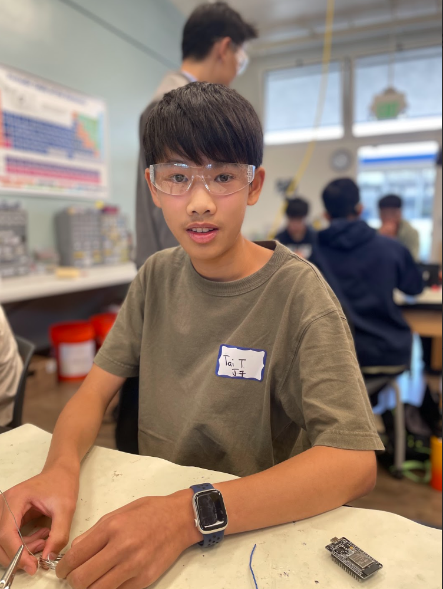
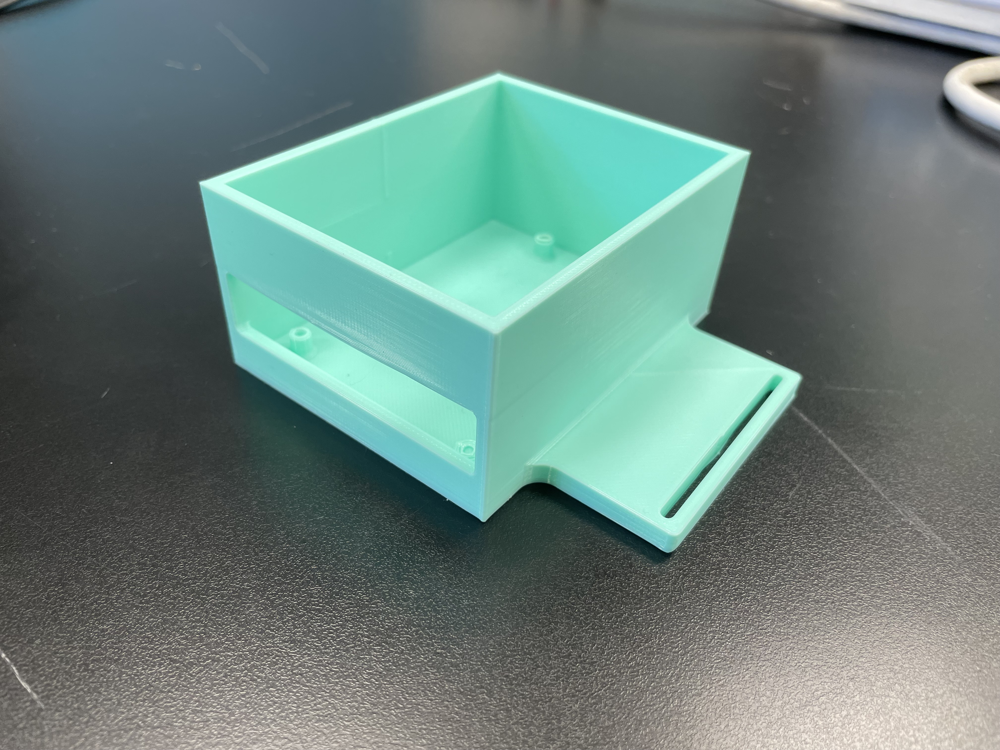
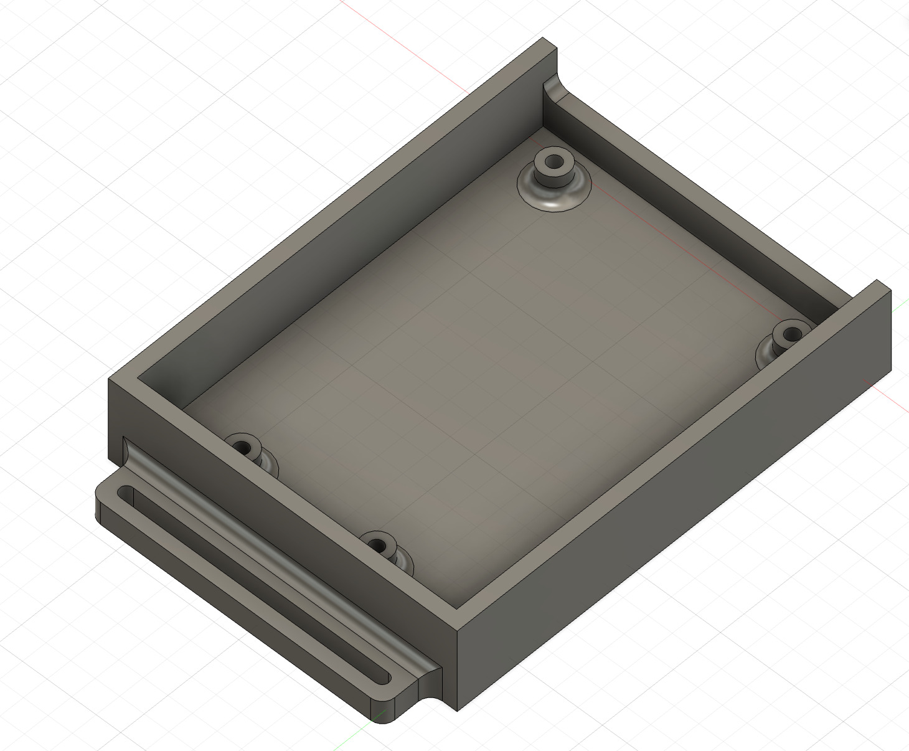
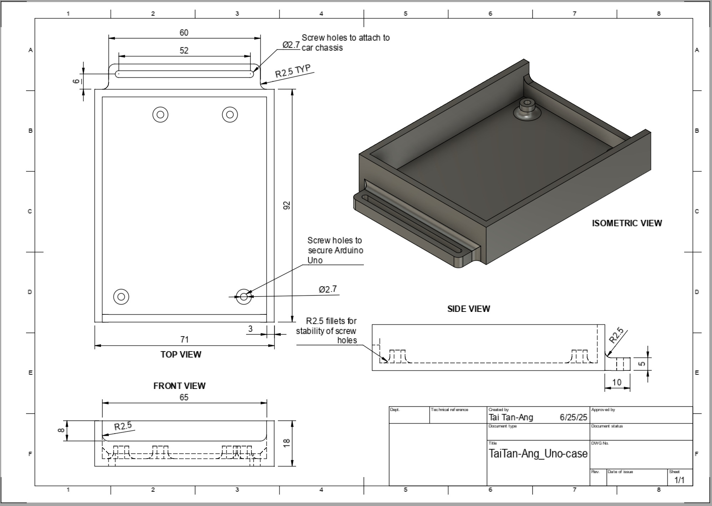
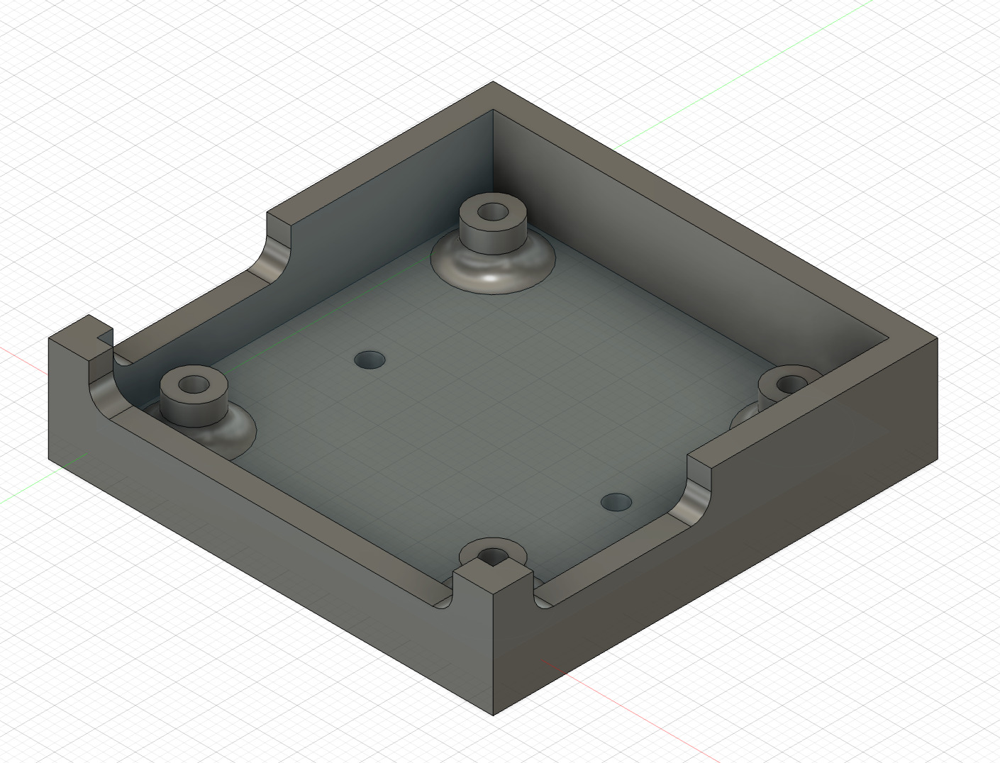
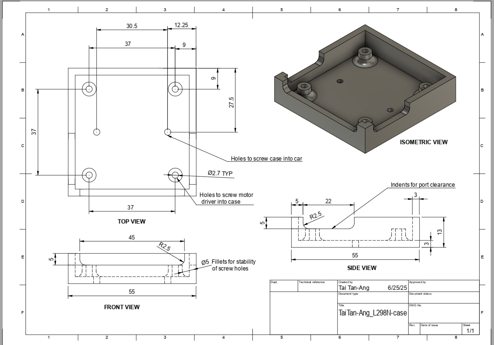
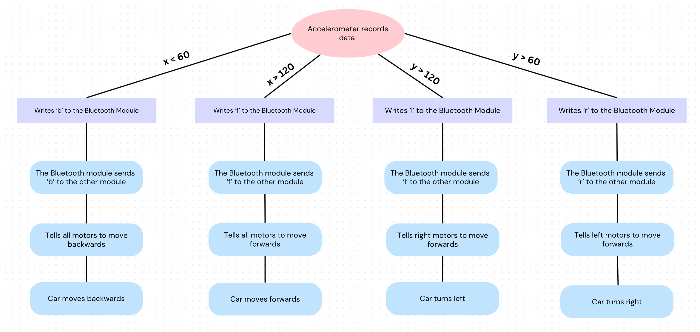
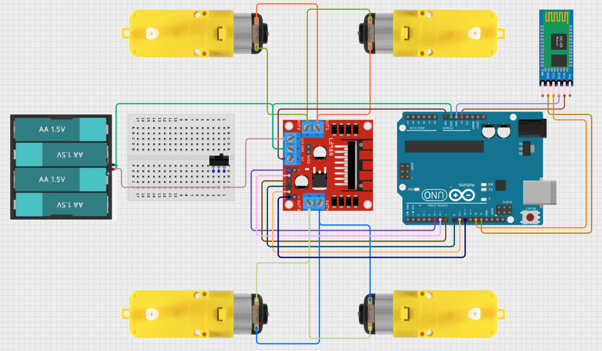
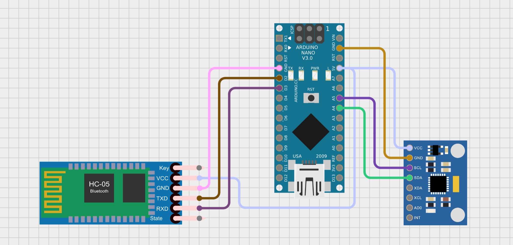
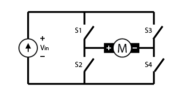

# Gesture Controlled Robot
<!-- Replace this text with a brief description (2-3 sentences) of your project. This description should draw the reader in and make them interested in what you've built. You can include what the biggest challenges, takeaways, and triumphs from completing the project were. As you complete your portfolio, remember your audience is less familiar than you are with all that your project entails! -->

<!-- You should comment out all portions of your portfolio that you have not completed yet, as well as any instructions: -->

| **Engineer** | **School** | **Area of Interest** | **Grade** |
|:--:|:--:|:--:|:--:|
| Tai T | Leigh High School | Mechanical Engineering | Incoming Sophomore


  
# Final Milestone

<!--**Don't forget to replace the text below with the embedding for your milestone video. Go to Youtube, click Share -> Embed, and copy and paste the code to replace what's below.**

<iframe width="560" height="315" src="https://www.youtube.com/embed/F7M7imOVGug" title="YouTube video player" frameborder="0" allow="accelerometer; autoplay; clipboard-write; encrypted-media; gyroscope; picture-in-picture; web-share" allowfullscreen></iframe> -->

### Description:

Text

### Challenges:

One challenge I faced during this milestone was that two of the motors weren't working properly. They wouldn't turn forward, but they were able to turn backward. I tested multiple possible ways this could have happened, including the code, wiring, solder connections, and even replacing the motor driver. However, the solution was to rotate the motor driver 180 degrees and plug the motor wires into the opposite ports. 

### Next steps:

This milestone means that I have finished the base project, and I will now start implementing some modifications. I will CAD a case to hide all of the wires and make the car look real, and try to add a few sensors to detect objects in its path. 

<!--
For your final milestone, explain the outcome of your project. Key details to include are:
- What you've accomplished since your previous milestone
- What your biggest challenges and triumphs were at BSE
- A summary of key topics you learned about
- What you hope to learn in the future after everything you've learned at BSE -->


Figure 4: First draft of the Arduino Uno CAD Model



Figure 5: Final CAD model of the Arduino Uno case and design drawing

Iterations:
 - lowered wall for easier access
 - widened holes from 2.5mm to 2.7mm to fit the M3 screws better
 - increased fillet size for stronger connections



Figure 6: CAD model of the L298N Motor Driver and design drawing

# Second Milestone

<iframe width="560" height="315" src="https://www.youtube.com/embed/3t_FfjB1K0o?si=XeNe177qP2UhYiog" title="YouTube video player" frameborder="0" allow="accelerometer; autoplay; clipboard-write; encrypted-media; gyroscope; picture-in-picture; web-share" referrerpolicy="strict-origin-when-cross-origin" allowfullscreen></iframe>

### Description:

Since the first milestone, I have been able to translate the movement of the glove into the wheels turning. To do this, I got the accelerometer to record its roll (x-axis), pitch (y-axis), and yaw (z-axis) and convert it into directions for the motors to follow (f for forward, b for backward). I then used the Bluetooth modules to send the directions over to the car (code documented in the Appendix, Milestone 2 Code, Glove ). Finally, I wrote more code to take those directions and move the motors accordingly (Appendix, Milestone 2, Car code). Refer to Figure 3 for a simplified code diagram.

### Challenges:

A challenge I had was getting the Bluetooth modules to send and receive data. Initially, when I was trying to send the letters from the glove to the car, it would receive the data as ? symbols. I discovered that this was because the baud rates weren't matched, which meant that one Bluetooth module was sending data faster than the other could receive it, resulting in the data getting jumbled. After fixing the problem with the code, it was able to work. 

### Next Steps:

I will start working on cleaning up all the wires, making the glove wearable, and adding finishing touches to the robot. 


Figure 3: Flowchart of the robot's movement code

<!--
For your second milestone, explain what you've worked on since your previous milestone. You can highlight:
- Technical details of what you've accomplished and how they contribute to the final goal
- What has been surprising about the project so far
- Previous challenges you faced that you overcame
- What needs to be completed before your final milestone -->

# First Milestone

<iframe width="560" height="315" src="https://www.youtube.com/embed/YEfgV6-EvwA?si=-ewlYNdKjjLRfh9_" title="YouTube video player" frameborder="0" allow="accelerometer; autoplay; clipboard-write; encrypted-media; gyroscope; picture-in-picture; web-share" referrerpolicy="strict-origin-when-cross-origin" allowfullscreen></iframe>

### Description:

My project is the Gesture Controlled Robot. For the first milestone, I completed the hardware for both the car and the glove. I soldered wires to the four motors, allowing them to connect to the L298N motor driver. Refer to the appendix section for how the motor driver works. This component is wired to the Arduino Uno, which is the 'brain' of the robot. By uploading code to it, the Arduino can tell the motor driver whether to spin forward or backward and at what speed (refer to Milestone 1 code in the appendix section). A battery case is also connected, with an on/off switch, for power. Finally, I added a Bluetooth Module to be able to communicate with the glove. Figure 1 in the schematics section shows the setup. The glove hardware is much simpler, only including an Arduino Nano, the second Bluetooth Module, and an accelerometer. The accelerometer will be used to measure the tilt of the glove. The glove hardware can be seen in Figure 2. 

### Challenges:

A challenge I had was pairing the two Bluetooth Modules together, because they weren't going into 'AT Mode'. But after some code and hardware changes, they were able to pair. I also figured out that after setting up the modules, the EN connection should be removed to let the module start pairing. 

### Next steps:

After this milestone, I will work on the software portion of the project, utilizing the Bluetooth connection to be able to steer the robot. 


# Schematics 

Figure 1: Schematic of the Gesture Controlled Robot car.


Figure 2: This is a schematic of the glove circuits. 

# Bill of Materials
<!-- Here's where you'll list the parts in your project. To add more rows, just copy and paste the example rows below.
Don't forget to place the link of where to buy each component inside the quotation marks in the corresponding row after href =. Follow the guide [here]([url](https://www.markdownguide.org/extended-syntax/)) to learn how to customize this to your project needs. -->

| **Part** | **Note** | **Price** | **Link** |
|:--:|:--:|:--:|:--:|
| Item Name | What the item is used for | $Price | <a href="https://www.amazon.com/Arduino-A000066-ARDUINO-UNO-R3/dp/B008GRTSV6/"> Link </a> |
| Item Name | What the item is used for | $Price | <a href="https://www.amazon.com/Arduino-A000066-ARDUINO-UNO-R3/dp/B008GRTSV6/"> Link </a> |
| Item Name | What the item is used for | $Price | <a href="https://www.amazon.com/Arduino-A000066-ARDUINO-UNO-R3/dp/B008GRTSV6/"> Link </a> |

# Other Resources/Examples
<!-- One of the best parts about Github is that you can view how other people set up their own work. Here are some past BSE portfolios that are awesome examples. You can view how they set up their portfolio, and you can view their index.md files to understand how they implemented different portfolio components.
- [Arduino to Motor Driver](https://www.youtube.com/watch?v=Ey4xoG970Go)
- [Bluetooth Setup](https://www.youtube.com/watch?v=I2qFXSe0W3w)
- [Example 3](https://arneshkumar.github.io/arneshbluestamp/) -->

# Starter Milestone
<iframe width="560" height="315" src="https://www.youtube.com/embed/UMIgmopNEKk?si=oT5W1rL70Gnku_Bd" title="YouTube video player" frameborder="0" allow="accelerometer; autoplay; clipboard-write; encrypted-media; gyroscope; picture-in-picture; web-share" referrerpolicy="strict-origin-when-cross-origin" allowfullscreen></iframe>

### Description:

My starter project was the Weevil Eye. I chose this project because it made me work on my soldering skills, and I got something cool to take home as well. The function of the Weevil Eye is that when it senses that it is dark, two LED 'eyes' turn on, and when there is light, it turns off.

### Challenges:

I faced numerous challenges while soldering to complete this project. It was my first day soldering, so my technique wasn't the best, resulting in the Weevil Eye not functioning properly. After a bit more practice soldering, I restarted with a new Weevil Eye, and that time it worked as intended. 

### Next steps:

The primary purpose of this project was for me to learn soldering, and it was successful. If I need to solder for my intensive project, I will know how to do it. 

# Appendix

### How H-bridges work


Figure 3: An H-bridge circuit

An L298N motor driver has two of these H-bridge circuits to allow the DC motors to turn forward and backward. This works because by switching the polarity on a DC motor, it changes the direction the motor spins. An H-bridge works by using four switches to control the current direction. For example, if switches 1 and 4 are closed, the current will run through from left to right. And if switches 2 and 3 are closed, the current runs in the opposite direction. Although a motor driver only has two H-bridges, I used one motor driver to control all four wheels by connecting the two motors on each side to one H-bridge. This works because I don't need motors on the same side to run in opposite directions.

## Milestone 2 Code

### Glove code:
```c++
#include <Wire.h>                          //including a library to get data from accelerometer
#include <SoftwareSerial.h>                //including a library for bluetooth communciation
SoftwareSerial Bluetooth(2,3);             //sets the bluetooth pins to 2 and 3 on the nano

const int MPU = 0x68;                      // MPU6050 I2C address
float AccX, AccY, AccZ;                    //variables for accelerometer data

void read(){
  Wire.beginTransmission(MPU);             //starts transmission to the accelerometer
  Wire.write(0x3B);                        //tells where to start reading from
  Wire.endTransmission(false);             //doesn't stop
  Wire.requestFrom(MPU, 6, true);          // request a total of 6 bytes

  AccX = (Wire.read() << 8 | Wire.read()); //combines two bytes from each axis 
  AccY = (Wire.read() << 8 | Wire.read()); //to get x, y, and z data
  AccZ = (Wire.read() << 8 | Wire.read());

  AccX = map(AccX, -17000, 17000, 0, 180); //maps the data (originally from around 
  AccY = map(AccY, -17000, 17000, 0, 180); // -17000 to 17000) to 0 to 180.
  AccZ = map(AccZ, -17000, 17000, 0, 180);


  Serial.print("X: ");                      //prints data for easy monitoring
  Serial.print(AccX);
  Serial.print("  Y: ");
  Serial.print(AccY);
  Serial.print("  Z: ");
  Serial.println(AccZ);
  delay(100);
}

void setup() {                                //setup code
  Wire.begin();                               //starts the accelerometer
  Wire.beginTransmission(MPU);                //starts a transmission to the
  Wire.write(0x6B);                           //0x6b register (which is responsible for power)
  Wire.write(0);                              // set to zero (wakes it up)
  Wire.endTransmission(true);                 //ends the transmission
  Serial.begin(9600);                         //starts serial
  Bluetooth.begin(9600);                      //starts bluetooth
}

void loop() {
  read();                                     //calls read function
  if(0 < AccX && AccX <= 20){                 //If X is between 0 and 20, which is high tilt backward,
    Bluetooth.write("B");                     //sends 'B' to the car
    delay(100);
  }
  else if(20 < AccX && AccX <= 40){           //If X is between 20 and 40, which is medium tilt backward,
    Bluetooth.write("b");                     //sends 'b' to the car
    delay(100);
  }
  else if(40 < AccX && AccX <= 60){           //If X is between 40 and 60, which is low tilt backward,
    Bluetooth.write("v");                     //sends 'v' to the car
    delay(100);
  }
  else if (180 > AccX && AccX >= 160){        //If X is between 180 and 160, which is high tilt forward,
    Bluetooth.write("F");                     //sends 'F' to the car
    delay(100);
  }
  else if (160 > AccX && AccX >= 140){        //If X is between 160 and 140, which is medium tilt forward,
    Bluetooth.write("f");                     //sends 'f' to the car
    delay(100);
  }
  else if (140 > AccX && AccX >= 120){        //If X is between 140 and 120, which is low tilt forward,
    Bluetooth.write("d");                     //sends 'd' to the car
    delay(100);
  } 
  else if (0 < AccY && AccY <= 20){           //If Y is between 0 and 20, which is high tilt right,
    Bluetooth.write("R");                     //sends 'R' to the car
    delay(100);
  } 
  else if (20 < AccY && AccY <= 40){          //If Y is between 20 and 40, which is medium tilt right,
    Bluetooth.write("r");                     //sends 'r' to the car
    delay(100);
  } 
  else if (40 < AccY && AccY <= 60){          //If Y is between 40 and 60, which is low tilt right,
    Bluetooth.write("e");                     //sends 'e' to the car
    delay(100);
  } 
  else if (180 > AccY && AccY >= 160){        //If Y is between 180 and 160, which is high tilt left,
    Bluetooth.write("L");                     //sends 'L' to the car
    delay(100);
  } 
  else if (160 > AccY && AccY >= 140){        //If Y is between 160 and 140, which is medium tilt right,
    Bluetooth.write("l");                     //sends 'l' to the car
    delay(100);
  } 
  else if (140 > AccY && AccY >= 120){        //If Y is between 140 and 120, which is low tilt right,
    Bluetooth.write("k");                     //sends 'k' to the car
    delay(100);
  } 
  else if (60 < AccX && AccX < 120 && 60 < AccY && AccY < 120){ //If both x and y are in neutral position,
    Bluetooth.write("S");                                       //Sends 'S' to the car
    delay(100);
  }
}

// Speeds:    Low   | Medium |  High  
// Forward:    d    |    f   |    F
// Backward:   v    |    b   |    B
// Right:      e    |    r   |    R
// Left:       k    |    l   |    L


```
### Driving code:
```c++
#include <SoftwareSerial.h>             //gets the bluetooth library
SoftwareSerial Bluetooth(12,13);        // sets the bluetooth module's pins to 12 and 13 on the uno
char data;                              //variable to store accelerometer's data
int speed = 255;                        //starting speed, can change

int enA = 5;                            //sets pins from the motor driver to 5-10 on the uno
int in1 = 6;
int in2 = 7;
int in3 = 8;
int in4 = 9;
int enB = 10;

void forward(){                         //function to drive forward
  digitalWrite(in1, HIGH);
  digitalWrite(in2, LOW);
  analogWrite(enA, speed);
  digitalWrite(in3, LOW);
  digitalWrite(in4, HIGH);
  analogWrite(enB, speed);
  delay(100);
}

void backward(){                         //function to drive backward
  digitalWrite(in1, LOW);
  digitalWrite(in2, HIGH);
  analogWrite(enA, speed);
  digitalWrite(in3, HIGH);
  digitalWrite(in4, LOW);
  analogWrite(enB, speed);
  delay(100);
}

void left(){                              //function to drive left
  digitalWrite(in1, HIGH);
  digitalWrite(in2, LOW);
  analogWrite(enA, speed);
  digitalWrite(in3, HIGH);
  digitalWrite(in4, LOW);
  delay(100);
}

void right(){                             //function to drive right
  digitalWrite(in1, LOW);
  digitalWrite(in2, HIGH);
  analogWrite(enB, speed);
  digitalWrite(in3, LOW);
  digitalWrite(in4, HIGH);
  delay(100);
}

void stop(){                              //function to stop the robot
  digitalWrite(in1, LOW);
  digitalWrite(in2, LOW);
  digitalWrite(in3, LOW);
  digitalWrite(in4, LOW);
  delay(100);
}


void setup() {                            //setup code, runs once
  Serial.begin(9600);                     //starts the serial monitor
  Bluetooth.begin(9600);                  //starts the bluetooth
  pinMode(enA, OUTPUT);                   //sets all the motor driver's pins to outputs.
  pinMode(in1, OUTPUT);
  pinMode(in2, OUTPUT);
  pinMode(in3, OUTPUT);
  pinMode(in4, OUTPUT);
  pinMode(enB, OUTPUT);
}

void loop() {                             //will run forever
  if(Bluetooth.available() > 0){          //runs if the bluetooth is connected
    data = Bluetooth.read();              //reads data from the acceleromter, stores it in the data var.
    delay(100);                           //keeps it from doing things too fast
    Serial.println(data);                 //prints data for easy montitoring
    if(data == 'F'){                      //'F' makes it go forward full speed
      forward();                          //Calls forward function
      speed = 255;                        //Sets speed to high
    }
    if(data == 'f'){                      //'f' makes it go forward medium speed
      forward();                          //Calls forward function
      speed = 200;                        //Sets speed to medium
    }
    if(data == 'd'){                      //'d' makes it go forward low speed
      forward();                          //Calls forward function
      speed = 150;                        //Sets speed to low
    }
    if(data == 'B'){                      //'B' makes it go backward full speed
      backward();                         //Calls backward function
      speed = 255;                        //Sets speed to high
    }
    if(data == 'b'){                      //'b' makes it go backward medium speed
      backward();                         //Calls backward function
      speed = 200;                        //Sets speed to medium
    }
    if(data == 'v'){                      //'v' makes it go backward low speed
      backward();                         //Calls backward function
      speed = 150;                        //Sets speed to low
    }
    if(data == 'R'){                      //'R' makes it go right full speed
      right();                            //Calls right function
      speed = 255;                        //Sets speed to high
    }
    if(data == 'r'){                      //'r' makes it go right medium speed
      right();                            //Calls right function
      speed = 200;                        //Sets speed to medium
    }
    if(data == 'e'){                      //'e' makes it go right low speed
      right();                            //Calls right function
      speed = 150;                        //Sets speed to low
    }
    if(data == 'L'){                      //'L' makes it go left full speed
      left();                             //Calls right function
      speed = 255;                        //Sets speed to high
    }
    if(data == 'l'){                      //'l' makes it go left medium speed
      left();                             //Calls right function
      speed = 255;                        //Sets speed to medium
    }
    if(data == 'k'){                      //'k' makes it go left low speed
      left();                             //Calls right function
      speed = 150;                        //Sets speed to low
    }
    if (data == 'S'){                     //'S' makes it go left full speed
      stop();                             //Calls stop function     
    }
  }
}

// Speeds:    Low   | Medium |  High  
// Forward:    d    |    f   |    F
// Backward:   v    |    b   |    B
// Right:      e    |    r   |    R
// Left:       k    |    l   |    L

```
## Milestone 1 Code

### Driving code:
```c++

int enA = 5;                  // Sets motor driver pins to 5-10 on the Uno
int in1 = 6;
int in2 = 7;
int in3 = 8;
int in4 = 9;
int enB = 10;

void driveforward(){          // Function to drive forward
  digitalWrite(in1, HIGH);
  digitalWrite(in2, LOW);
 analogWrite(enA, 255);
  digitalWrite(in3, LOW);
  digitalWrite(in4, HIGH);
  analogWrite(enB, 255);
  delay(1000);
}

void drivebackward(){          // Function to drive backward
  digitalWrite(in1, LOW);
  digitalWrite(in2, HIGH);
  analogWrite(enA, 255);
  digitalWrite(in3, HIGH);
  digitalWrite(in4, LOW);
  analogWrite(enB, 255);
  delay(1000);
}

void left(){                    // Function to drive left
  digitalWrite(in1, HIGH);
  digitalWrite(in2, LOW);
  analogWrite(enA, 255);
  digitalWrite(in3, LOW);
  digitalWrite(in4, LOW);
  delay(1000);
}

void right(){                   // Function to drive right
  digitalWrite(in1, LOW);
  digitalWrite(in2, LOW);
  analogWrite(enA, 255);
  digitalWrite(in3, LOW);
  digitalWrite(in4, HIGH);
  delay(1000);
}

void stop(){                    // Function to stop
  digitalWrite(in1, LOW);
  digitalWrite(in2, LOW);
  digitalWrite(in3, LOW);
  digitalWrite(in4, LOW);
  delay(1000);
}


void setup() {                   //Setup code, runs once
  Serial.begin(9600);            //Starts serial monitor
  pinMode(enA, OUTPUT);          //Sets motor driver pins to outputs
  pinMode(in1, OUTPUT);
  pinMode(in2, OUTPUT);
  pinMode(in3, OUTPUT);
  pinMode(in4, OUTPUT);
  pinMode(enB, OUTPUT);

}

void loop(){                     // Code runs in a loop forever
  driveforward();                // Makes wheels run forward,
  stop();                        // then stop,
  drivebackward();               // backward,
  stop();                        // and stop again, then repeats
}

```

### Get data from accelerometer:
```c++
#include <Wire.h>                             //including a library to get data from accelerometer

const int MPU = 0x68;                         // MPU6050 I2C address
float AccX, AccY, AccZ;

void setup() {                                //setup code
  Wire.begin();                               //starts the accelerometer
  Wire.beginTransmission(MPU);                //starts a transmission to the
  Wire.write(0x6B);                           //0x6b register (which is responsible for power)
  Wire.write(0);                              // set to zero (wakes it up)
  Wire.endTransmission(true);                 //ends the transmission
  Serial.begin(9600);                         //starts serial
}

void loop() {
  Wire.beginTransmission(MPU);                //starts transmission to the accelerometer
  Wire.write(0x3B);                           //tells where to start reading from
  Wire.endTransmission(false);                //doesn't stop
  Wire.requestFrom(MPU, 6, true);             // request a total of 6 bytes
  
  AccX = (Wire.read() << 8 | Wire.read());    //combines two bytes from each axis 
  AccY = (Wire.read() << 8 | Wire.read());    //to get x, y, and z data
  AccZ = (Wire.read() << 8 | Wire.read());

  AccX = map(AccX, -17000, 17000, 0, 180);    //maps the data (originally from around 
  AccY = map(AccY, -17000, 17000, 0, 180);    // -17000 to 17000) to 0 to 180.
  AccZ = map(AccZ, -17000, 17000, 0, 180);


  Serial.print("X: ");                        //prints data for easy monitoring
  Serial.print(AccX);
  Serial.print("  Y: ");
  Serial.print(AccY);
  Serial.print("  Z: ");
  Serial.println(AccZ);
  delay(100);
}
```

### Set up AT Commands for Bluetooth Modules:
```c++
#include <SoftwareSerial.h>           //Imports bluetooth library
SoftwareSerial Bluetooth(2,3);        // Sets bluetooth module's pins to 2 and 3 on the nano

void setup() {                        //Setup code, runs once
  Serial.begin(38400);                //Starts serial
  Bluetooth.begin(38400);             //starts bluetooth
}

void loop() {                         //Loop code, runs forever
  if (Serial.available()){            //The two if statements allow AT commands to be
    Bluetooth.write(Serial.read());   //typed from the serial monitor to the bluetooth
  }                                   //to set it up as either a slave or master and bind
  if (Bluetooth.available()){         //it to the other module
    Serial.write(Bluetooth.read());
  }
}

```

